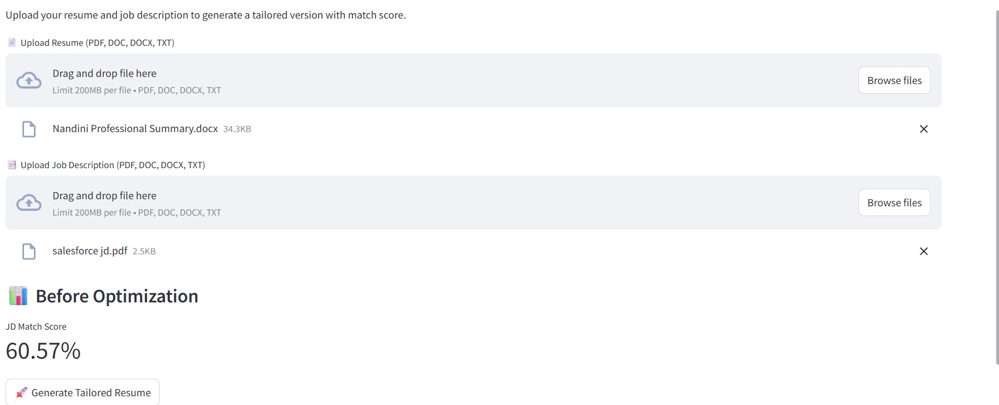
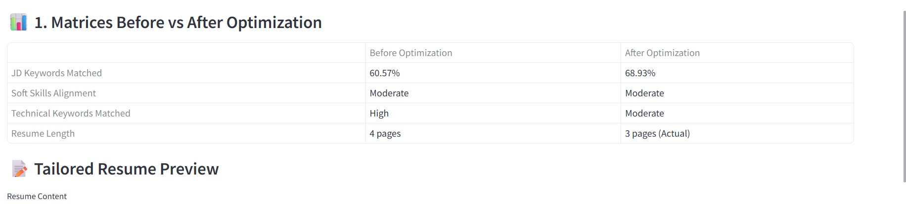

# 🧠 AI-Powered Resume Assistant

An intelligent, Streamlit-based application that rewrites and optimizes resumes to better align with job descriptions using GPT-4. It provides keyword match scores, skill alignment analysis, and generates a professionally tailored PDF resume.

---

## 🚀 Features

✅ Upload Resume and Job Description in `.pdf`, `.doc`, `.docx`, or `.txt` formats  
✅ Intelligent tailoring of resume content using OpenAI GPT-4  
✅ Retains important technical keywords even if they are not present in the JD  
✅ Match score analysis based on keyword similarity  
✅ Soft skills and technical skills alignment scoring  
✅ Actual page count from generated PDF resume  
✅ Download tailored resume as a polished PDF  
✅ Resume history stored in a local SQLite database  
✅ Clean and responsive Streamlit UI  

---

## 🗂️ Project Structure

```
AI-Powered Resume Assistant/
│
├── resume.py               # Main Streamlit application
├── .env                    # OpenAI API Key (excluded from Git)
├── requirements.txt        # Python dependencies
├── README.md               # Project documentation
├── JD.jpeg                 # Screenshot: JD Upload
├── Metrics.jpeg            # Screenshot: Metrics Output
└── resume_history.db       # Local SQLite DB for resume storage (auto-created)
```

---

## 🛠️ Installation

```bash
git clone https://github.com/<username>/AI-Powered-Resume-Assistant.git
cd AI-Powered-Resume-Assistant
pip install -r requirements.txt
```

Create a `.env` file in the root folder with:

```env
OPENAI_API_KEY=your_openai_api_key_here
```

---

## ⚡ Usage

```bash
streamlit run resume.py
```

---

## 📸 Screenshots

### 📑 Job Description Upload



---

### 📊 Metrics Comparison After Tailoring



---

## ⚒️ Requirements

- Python 3.8+  
- LibreOffice (optional, for `.doc` file conversion)  

---

## 💡 Future Enhancements

- Resume keyword cloud visualization  
- JD keyword extraction summary  
- Option to fine-tune optimization aggressiveness  
- Multi-language support  

---

## 🤖 Powered By

- [OpenAI GPT-4](https://platform.openai.com)  
- [Streamlit](https://streamlit.io)  
- [pdfplumber](https://github.com/jsvine/pdfplumber)  
- [PyPDF2](https://pypi.org/project/PyPDF2/)  
- [scikit-learn](https://scikit-learn.org)  

---

## 📄 License

This project is intended for learning and personal use only. Commercial distribution is not permitted.

---

## 🙏 Acknowledgements

Built to address the challenge of customizing resumes for today's competitive job market.

---

# 👨‍💻 Author

[](https://github.com/Spandit11/ai-incident-management-system#%E2%80%8D-author)
**Sourabh Pandit**

Generative AI • Agentic AI • Azure PaaS • Cloud-Native .NET Solutions

This project was developed as a practical Proof of Concept demonstrating:

- Multi-Agent AI
- LangGraph Orchestration
- Retrieval-Augmented Generation (RAG)
- Memory Management
- Guardrails & Observability
- Production-Inspired Architecture Patterns

### Connect

[](https://github.com/Spandit11/ai-incident-management-system#connect)

- LinkedIn: [https://www.linkedin.com/in/sourabh-pandit-b2570212](https://www.linkedin.com/in/sourabh-pandit-b2570212)
- GitHub: [https://github.com/Spandit11/ai-incident-management-system](https://github.com/Spandit11/ai-incident-management-system)
